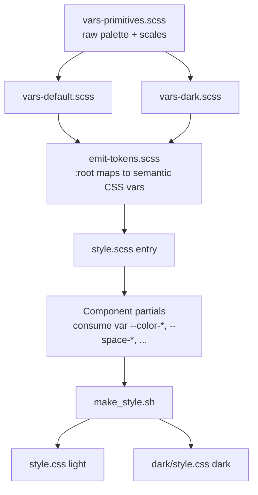

# 04 — Technical Design

How the design system is implemented on top of the existing Django + SCSS +
`django-compressor` pipeline, with minimal risk and full backward compatibility.

## 1. Current architecture (as-is)

Grounded in the repository:

- **Build**: `make_style.sh` copies `resources/vars-<theme>.scss` → `resources/vars.scss`,
  runs `sass resources:sass_processed`, then `postcss` with `autoprefixer`, writing
  `resources/style.css` (light) and `resources/dark/style.css` (dark).
- **Entry point**: `resources/style.scss` `@import`s `base`, `navbar`, `table`,
  `problem`, `status`, `submission`, `contest`, etc. Each imports `vars` (which is
  the copied theme file), so the two themes are two full compiled stylesheets.
- **Tokens today**: SCSS variables split across `vars-common.scss` (shared:
  `$base_font_size`, `$widget_border_radius`, `$monospace-fonts`),
  `vars-default.scss` (light), and `vars-dark.scss` (dark). Blog already added a
  richer `$color_blog_*` set.
- **Theme selection**: `Profile.site_theme` (`auto`/`light`/`dark`, see
  `judge/models/choices.py` `SITE_THEMES`). `judge/template_context.py::site_theme`
  exposes `LIGHT_STYLE_CSS`, `DARK_STYLE_CSS`, `PREFERRED_STYLE_CSS` from
  `settings.DMOJ_THEME_CSS = {'light': 'style.css', 'dark': 'dark/style.css'}`.
- **Template**: `templates/base.html` links either a single `PREFERRED_STYLE_CSS`
  or both light/dark via `media="(prefers-color-scheme: ...)"`, but only for users
  with the `judge.test_site` permission; everyone else gets `LIGHT_STYLE_CSS`. A
  `TODO` notes dark mode should ship for all users once it's solid.

### Constraints this imposes

- Every visual value is baked into two compiled CSS files. Theme switching means
  loading a different file; there is no runtime variable layer.
- `django-compressor` (``) concatenates/minifies at deploy; the
  linked hrefs come from `static(...)`.
- We must not break the `make_style.sh` outputs or the `DMOJ_THEME_CSS` contract.

## 2. Target architecture (to-be)

Introduce a **CSS custom-property token layer** that both compiled themes emit,
while keeping SCSS for structure. This is additive and backward compatible.



### 2.1 Token emission strategy

Two viable approaches; **Approach A is recommended**.

**Approach A — Semantic vars emitted per compiled theme (recommended).**
Each theme file still exists, but instead of components reading SCSS `$color_*`
directly, a shared partial emits a `:root { ... }` block mapping semantic CSS
variables to that theme's values.

- `style.css` (light build) emits light values into `:root`.
- `dark/style.css` (dark build) emits dark values into `:root`.
- Components reference `var(--color-surface)` etc., never the SCSS var.

Pros: zero change to `make_style.sh`, the `DMOJ_THEME_CSS` contract, or how
`base.html` links files. Instant groundwork for a future single-file runtime
toggle. Lowest risk.

Cons: still ships two files (fine — matches today).

**Approach B — Single stylesheet with `[data-theme]` runtime switch.**
Emit both light and dark token blocks in one CSS file:
`:root { light } :root[data-theme="dark"] { dark }`, toggled by a `data-theme`
attribute on `<html>` set from `Profile.site_theme` (and `prefers-color-scheme`
for `auto`). One compiled stylesheet for structure + one for tokens.

Pros: instant theme switching with no reload, no flash; enables user theme toggle;
smaller conceptual model.

Cons: larger change to `make_style.sh`, `base.html`, and `template_context`;
requires an inline no-flash script. Defer to a later phase.

**Decision:** implement Approach A first (Phase 1–2), keep the door open to migrate
to Approach B in a later phase once tokens are proven. See `06-roadmap-and-tasks.md`.

### 2.2 File layout changes

New/refactored files under `resources/`:

```
resources/
  vars-primitives.scss     # NEW: raw palettes + numeric scales (theme-independent)
  vars-common.scss         # KEEP: non-color shared (fonts stack names, base size)
  vars-default.scss        # REFACTOR: light semantic map (SCSS vars) + @forward primitives
  vars-dark.scss           # REFACTOR: dark semantic map (SCSS vars) + @forward primitives
  _emit-tokens.scss        # NEW: emits :root { --color-*: ...; --space-*: ...; }
  _mixins.scss             # NEW: helpers (focus-ring, elevation, truncation, media)
  style.scss               # UPDATE: @import "emit-tokens" before component partials
  base.scss                # UPDATE: consume tokens (background, typography, links)
  navbar.scss ...          # UPDATE incrementally per component roadmap
```

`_emit-tokens.scss` is a fragment (leading underscore) so `sass` won't compile it
standalone. `style.scss` imports it once, right after `vars`, so `:root` is defined
before any component rule uses `var(--...)`.

### 2.3 Backward-compatible token bridging

To avoid a big-bang rewrite, keep the legacy SCSS variables working during
migration by defining them in terms of the new tokens (or vice versa). Concretely,
in each theme file the semantic SCSS vars and the primitives coexist, and
`_emit-tokens.scss` maps them to CSS vars. Legacy names like `$color_primary10`
remain valid until their consumers are migrated, then are removed.

Migration rule: when a component partial is touched, convert its hardcoded values
and legacy `$color_*` refs to `var(--...)` tokens. Untouched partials keep
compiling unchanged.

## 3. Theming and no-flash behavior

Phase 1–2 (Approach A) keeps the current mechanism: `base.html` links the correct
compiled file based on `PREFERRED_STYLE_CSS` / `prefers-color-scheme`. No new flash
risk because the browser picks the stylesheet before paint via the `media` query.

When/if Approach B lands:

- Set `<html data-theme="...">` server-side from `request.profile.site_theme` so
  there is no flash for logged-in users.
- For `auto`, inline a tiny blocking script in `<head>` that reads
  `prefers-color-scheme` and sets `data-theme` before first paint.
- Keep `DMOJ_THEME_CSS` working; the structural stylesheet stays a single link.

## 4. Rollout gating (test_site permission)

Reuse the existing `judge.test_site` permission and the `base.html` branch to ship
the redesign to opt-in users first (matches the current dark-mode gating and
`ProfileForm`'s "Enable experimental features" toggle). Concretely:

- Build the redesigned stylesheet(s) and expose them via new
  `DMOJ_THEME_CSS`-style settings (e.g. behind a setting flag), OR
- Land token + component changes directly in the existing stylesheets but keep any
  layout-breaking changes gated until validated.

Prefer the incremental in-place approach (tokens are backward compatible), using
`test_site` only for changes that visibly alter layout, so the general redesign can
graduate by simply flipping the default — consistent with the `base.html` `TODO`.

Any new setting follows the repo convention (`DMOJ_*` / `VNOJ_*` in
`dmoj/settings.py`, documented, not hardcoded — see `AGENTS.md`).

## 5. Build, lint, and verification impact

- **Styles build**: `./make_style.sh` must succeed for both themes after each
  change (needs `npm ci` for `postcss`/`sass`/`autoprefixer`). This is the primary
  gate for CSS work (mirrors the `styles` CI job in `.github/workflows/build.yml`).
- **Browser support**: CSS custom properties and the color values are covered by
  the project's `.browserslistrc`/`autoprefixer`; verify no target in
  `caniuse.json` regresses. Custom properties are broadly supported by the existing
  targets; confirm during Phase 1.
- **Python/tests**: no model or view changes are required for Phase 1–2, so
  `python manage.py test judge` and `flake8` are unaffected. If a settings flag or
  `template_context` change is added later, include it in the same change and keep
  `flake8` clean (max line length 120, pycharm import order).
- **Websocket**: unaffected; `npm run format:check` scope is `websocket/` only.

## 6. Risks and mitigations

| Risk                                             | Mitigation                                                        |
| ------------------------------------------------ | ----------------------------------------------------------------- |
| Big-bang refactor breaks many pages              | Token layer is additive; migrate partials one at a time (Phase 3).|
| Dark mode regressions for existing users         | Keep `test_site` gating for layout-affecting changes.             |
| `django-compressor` caching serves stale CSS     | Rely on existing compressor hashing; bump on deploy as today.     |
| Web font loading hurts LCP                        | `font-display: swap`, system-font fallback, self-host if needed.  |
| Color contrast regressions                        | Validate every semantic pair against `07-accessibility.md`.       |
| Legacy `$color_*` refs left dangling after rename | Remove a primitive only when all consumers are migrated.          |

## 7. Definition of done (technical)

- `vars-primitives.scss` + `_emit-tokens.scss` exist; both compiled themes emit the
  full semantic token set to `:root`.
- `make_style.sh` builds both themes with no errors and no new `autoprefixer`
  warnings for supported browsers.
- At least the Phase-2 core components consume tokens only (no hardcoded hex in
  those partials).
- Documentation values (03) match the implemented token values.
- No regression in `flake8`, `manage.py test judge`, or `npm run format:check`.
